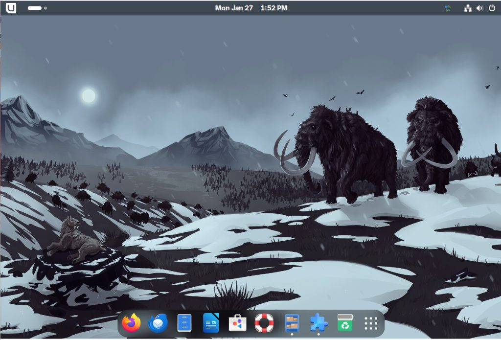

# mdo

**Markdown to HTML5**

A fast lightweight command-line tool written in Rust that converts Markdown into HTML, with optional file-manager integration for immediate on-the-fly viewing. The CLI supports live watch mode to automatically re-render whenever the Markdown file is edited.

```bash
cargo install mdo-cli
```

| Download | Source | Package | Metrics |
|---|---|---|---|
| [GitHub Releases](https://github.com/maphew/mdo/releases) | [GitHub](https://github.com/maphew/mdo) | [crates.io](https://crates.io/crates/mdo-cli) | [Public metrics](metrics/) |

Binary: `mdo`  
Package: `mdo-cli`  
License: MIT or Apache-2.0



> **Sample preview:** [Open `sample.md` rendered by mdo](assets/sample.html). The preview page is generated from Markdown with the same runtime CSS pipeline and its own docs-only `--css` override.

## Why mdo?

Markdown is excellent for authoring and diffs, but long local Markdown files are calmer to read as browser-rendered HTML.

There are countless Markdown-to-HTML converters available, so why make another one and risk becoming another [xkcd:927](https://xkcd.com/927/) footnote?

I could not find a simple, fast, and self-contained solution. Everything I looked at wanted to be a full-featured editor, relied on node or python in `PATH`, or needed another runtime dependency. Every day I read dozens to hundreds of Markdown files, and reading them as HTML is richer and calmer.

`mdo` plus file-manager integration creates disposable HTML pages quickly enough that opening Markdown can feel like opening a text file. That means fewer generated artifacts in source folders and fewer agent-workflow prompts that spend tokens asking for an HTML report.

| Goal | What it means |
|---|---|
| Fast local reading | Render and open Markdown from your desktop or shell without waiting on a runtime stack. |
| Throw-away friendly | `--open` writes to a stable temp path, so source folders stay clean by default. |
| Self-contained output | Generated pages include their own styling and work offline with no network assets. |

## Install

Start with the hosted installer unless you already use Rust. It fetches the latest GitHub Release, verifies `SHA256SUMS`, and installs `mdo` into a user-local bin directory.

### Linux and macOS

```bash
curl -fsSL https://maphew.github.io/mdo/install.sh | sh
```

Installs to `$HOME/.local/bin` by default. Set `MDO_INSTALL_DIR` first to choose another directory.

### Windows PowerShell

```powershell
irm https://maphew.github.io/mdo/install.ps1 | iex
```

Installs to `%LOCALAPPDATA%\mdo\bin` by default and adds that directory to your user `PATH` when needed.

### Cargo for Rust developers

```bash
cargo install mdo-cli
mdo --version
```

Cargo builds from source, so native downloads are usually simpler for non-Rust users.

### Manual archives

Release archives and `SHA256SUMS` are available from [GitHub Releases](https://github.com/maphew/mdo/releases). Linux and Windows archives include the setup helper for guided file-manager integration.

## New User Tour

The cautious path is built in: learn what mdo will do before changing any file-manager setting.

### Explore first

```bash
mdo --tour
mdo --help
mdo --open notes.md
```

The tour explains the render-and-open workflow, the normal convert-once command, and the reversible integration commands.

### Opt in when ready

Running `mdo` with no arguments in an interactive terminal shows the same tour. On Windows and Linux it can offer to install **Open as HTML** for the current user only. The default answer is **Yes**, but mdo still does not change the default Markdown app. Choose **No** to skip or run the installer again later.

After you press Enter to close the tour, mdo opens a short welcome sample so you can immediately verify the browser-opening flow. On Windows and Linux release builds, `mdo-setup` / `mdo-setup.exe` provides the same onboarding path in native desktop dialogs instead of a terminal window.

On Windows, launching `mdo-open.exe` directly with no file opens the terminal tour in a fresh Windows Terminal (`wt`) window using the **One Half Light** color scheme, centered on the active display; if `wt` is unavailable, it falls back to `mdo-setup.exe` when present.

## Usage

By default, `mdo` writes a styled HTML file beside the source Markdown file. Use `--open` to render into a stable temp path and launch the default browser.

### Common commands

```bash
mdo --tour
mdo notes.md
mdo notes.md -o public/notes.html
mdo --css my-overrides.css notes.md
mdo --css restore-simple-css.css notes.md
mdo --bare notes.md
mdo --watch notes.md
mdo --open notes.md
```

### What the output includes

- HTML5 document shell with responsive viewport metadata
- Embedded simple.css plus calmer mdo heading defaults
- Optional `--css` overrides appended after defaults
- Release CSS to restore the vendored simple.css typography
- Tables, footnotes, task lists, and strikethrough
- Title derived from the first top-level heading
- Light/dark theme toggle in styled output

## File Manager Integration

Open Markdown files from the desktop without leaving generated HTML beside the source file. Every integration launches the same `mdo --open` render-and-open path.

### Windows Explorer

```powershell
mdo-setup.exe
mdo.exe --install-file-manager
mdo.exe --uninstall-file-manager
```

- Right-click a `.md` file and choose **Open as HTML**; on Windows 11 it may be under **Show more options**.
- **Open with** offers **Open as HTML**.
- If **Open as HTML** is made the default handler, double-click opens the browser.
- If `mdo-open.exe` is next to `mdo.exe`, it is used for flash-free Explorer launches; otherwise the single `mdo.exe` binary still works.
- Launching `mdo-open.exe` with no file opens the terminal tour in a fresh `wt` window with the **One Half Light** color scheme and centers it on the active display, falling back to `mdo-setup.exe` when `wt` cannot be started.
- Windows Open With should show the friendly name **Open as HTML** with the mdo icon instead of exposing the wrapper file name.

### Linux File Managers

```bash
mdo-setup
mdo --install-file-manager
mdo --install-file-manager --set-default
mdo --uninstall-file-manager
```

- `mdo-setup` shows the same no-terminal onboarding flow in desktop dialogs when `zenity`, `kdialog`, or `yad` is available.
- Most XDG file managers show **Open With -> Open as HTML** for Markdown files.
- GNOME Files/Nautilus uses the same Open With entry; no duplicate Scripts item is installed.
- With `--set-default`, double-clicking Markdown files launches the browser.
- Launching `mdo-open` with no file opens `mdo-setup` when present.

### macOS Finder

```bash
for file in "$@"; do
  /path/to/mdo --open "$file"
done
```

- No bundled installer yet; create an Automator Quick Action that receives files in Finder.
- Add **Run Shell Script**, pass input as arguments, and use the absolute path to `mdo`.
- Save it as **Open as HTML** so Finder exposes it under Quick Actions.

Apple reference: [Quick Action workflows](https://support.apple.com/en-by/guide/automator/use-quick-action-workflows-aut73234890a/2.10/mac/15.0) and [Run Shell Script](https://support.apple.com/guide/automator/use-scripts-aut4bb6b2b4f/mac).

### Result examples

Each path below is stable for the source file, so reopening the same Markdown overwrites the same rendered page instead of accumulating generated files.

```text
Windows  %TEMP%\mdo\{hash}\notes.html
Linux    /tmp/mdo-{uid}/{hash}/notes.html
macOS    $TMPDIR/mdo/{hash}/notes.html
```

## Project Links

Release notes, architecture decisions, source code, and package metadata are all kept in the public repository.

| Link | Destination |
|---|---|
| GitHub Releases | [github.com/maphew/mdo/releases](https://github.com/maphew/mdo/releases) |
| Public Metrics | [metrics/](metrics/) |
| Changelog | [CHANGELOG.md](https://github.com/maphew/mdo/blob/main/CHANGELOG.md) |
| Distribution ADR | [adr/0002-distribution-strategy.html](adr/0002-distribution-strategy.html) |
| Tooling ADR | [adr/0003-keep-python-metrics-tooling.html](adr/0003-keep-python-metrics-tooling.html) |
| docs.rs | [docs.rs/mdo-cli](https://docs.rs/mdo-cli) |
| Issues | [github.com/maphew/mdo/issues](https://github.com/maphew/mdo/issues) |

---

mdo is dual-licensed under MIT or Apache-2.0 and forked with gratitude from Hafiz Ali Raza's original Markdown-to-HTML CLI.
